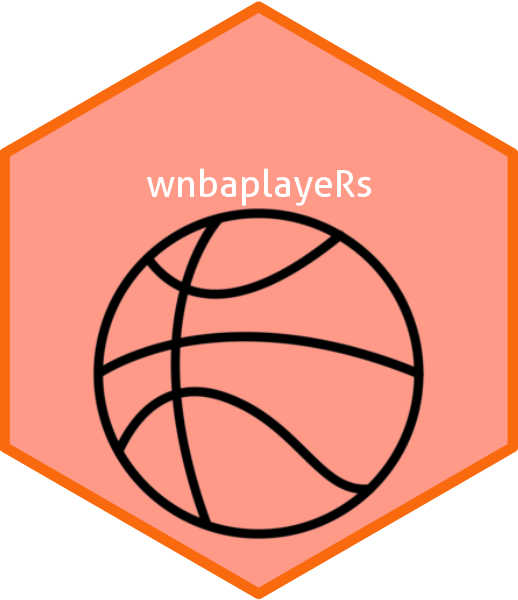

<!-- README.md is generated from README.Rmd. Please edit that file -->

```{r, include = FALSE}
knitr::opts_chunk$set(
  collapse = TRUE,
  comment = "#>",
  fig.path = "man/figures/README-",
  out.width = "100%"
)
```

# wnbaplayeRs R package 

<!-- badges: start -->
[](https://lifecycle.r-lib.org/articles/stages.html#experimental)
[](https://CRAN.R-project.org/package=packageName)
<!-- badges: end -->


<br>

## Summary

R package for WNBA player data

This package uses data from the WNBA website which contains WNBA player data from the 2002 season to the 2024 season, including a player's team, age, and various game statistics. The package's goal is to make women's professional basketball more accessible to the general public, more specifically, people who are not already familiar with the WNBA. The package does this by summarizing and visualizing player data and allowing for comparisons between players. The functions include:

- `get_wnba_player_stats()`, which retrieves the statistics and of a specified WNBA player from the dataset and links to the player's stats webpage.
- `wnba_stat_grapher()`, which graphs a statistic for one or more WNBA players selected from the data over the course of their time in the WNBA.


## Installation

You can install the development version of wnbaplayeRs from [GitHub](https://github.com/) with:

``` r
# install.packages("devtools")
devtools::install_github("sds270-f24/wnbaplayeRs")
```

You can load the package using:

``` r
library(wnbaplayeRs)
```

## Data

Included in this package is player data sourced from the WNBA's official website.

## Examples

##### Example 1

Using the `get_wnba_player_stats` function, users can easily get a snapshot of information about a selected player, and can get quickly linked to the player's stat webpage. 

```{r, message = T}
library(wnbaplayeRs)

get_wnba_player_stats("Caitlin Clark")

```

##### Example 2

Using the `wnba_stat_grapher` function, users can visualize a selected statistic of one or more players in order to see change over time, as well as compare players. 

```{r}
wnba_stat_grapher("Sue Bird", "f_tr")
```


## Package Contributors:

-   [Greta Anesko](https://github.com/ganesko)
-   [Soph Hillard](https://github.com/s0ph1ah)
-   [Callie Showalter](https://github.com/callieshow)